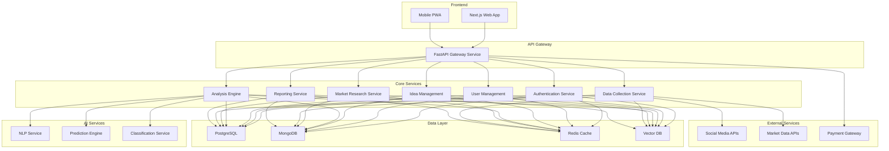

```mermaid
graph TD
    subgraph Frontend
        A[Next.js Web App]
        B[Mobile PWA]
    end

    subgraph API Gateway
        C[FastAPI Gateway Service]
    end

    subgraph Core Services
        D[Authentication Service]
        E[User Management]
        F[Idea Management]
        G[Analysis Engine]
        H[Market Research Service]
        I[Data Collection Service]
        J[Reporting Service]
    end

    subgraph AI Services
        K[NLP Service]
        L[Prediction Engine]
        M[Classification Service]
    end

    subgraph Data Layer
        N[PostgreSQL]
        O[MongoDB]
        P[Redis Cache]
        Q[Vector DB]
    end

    subgraph External Services
        R[Social Media APIs]
        S[Market Data APIs]
        T[Payment Gateway]
    end

    A --> C
    B --> C
    C --> D & E & F & G & H & I & J
    G --> K & L & M
    D & E & F & G & H & I & J --> N & O & P & Q
    I --> R & S
    C --> T
```
