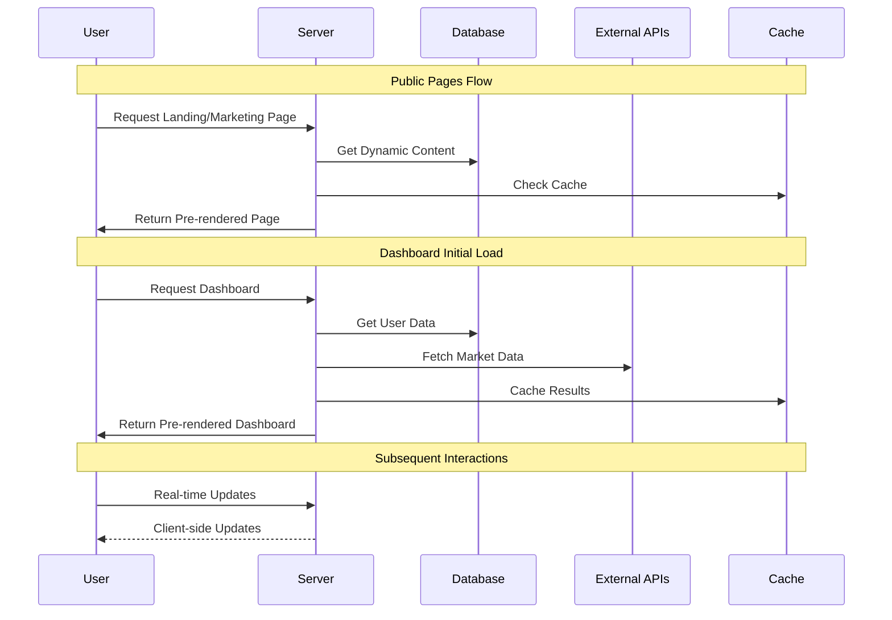

```mermaid
sequenceDiagram
    participant U as User
    participant S as Server
    participant DB as Database
    participant API as External APIs
    participant C as Cache

    Note over U,C: Public Pages Flow
    U->>S: Request Landing/Marketing Page
    S->>DB: Get Dynamic Content
    S->>C: Check Cache
    S->>U: Return Pre-rendered Page
    
    Note over U,C: Dashboard Initial Load
    U->>S: Request Dashboard
    S->>DB: Get User Data
    S->>API: Fetch Market Data
    S->>C: Cache Results
    S->>U: Return Pre-rendered Dashboard
    
    Note over U,C: Subsequent Interactions
    U->>S: Real-time Updates
    S-->>U: Client-side Updates
```
